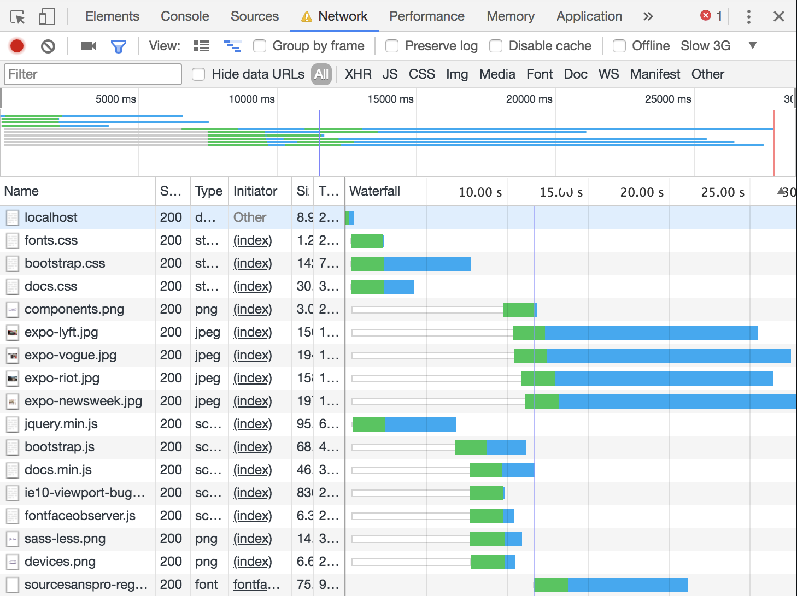
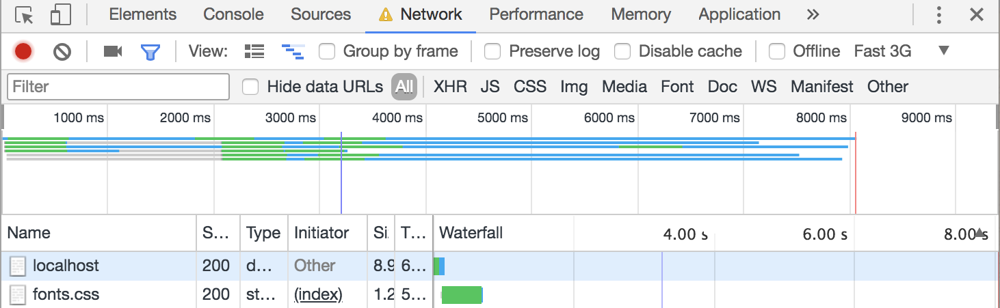
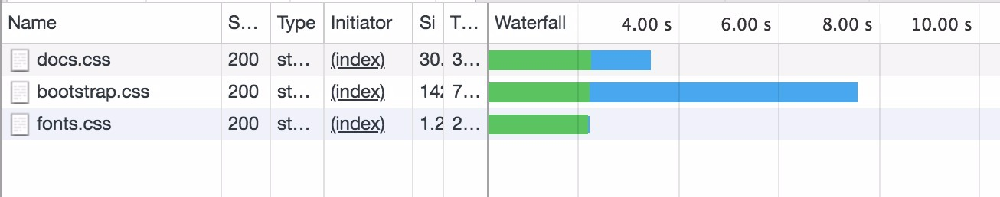
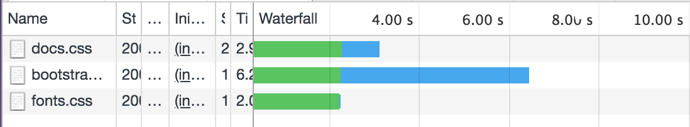

<<<<<<< HEAD
# Fonts


Font loaded


Font loaded

# minfied CSS


Unminified CSS files!



Minified CSS files!

The CSS that is minified changed a lot on slow 3G setting. Especially the bootstrap file. a Whole second! WOAH!.

# webp

[Without webp](without-webp.png)
it takes 30 seconds to load the page without webp

[With webp](with-webp.png)
it takes 18 seconds to load the page with webp

# Lazyloading

(with LazyLoading)[with-lazy-loading.png]
The website loading with lazyloading. The red line is the indicator that the loading is done but there are things to be loaded in.
After the red line the images load in because you scrolled there.

```JS

const images = document.querySelectorAll('[data-src]');
const config = {
  rootMargin: '0px 0px 50px 0px',
  threshold: 0
};
let loaded = 0;

const observer = new IntersectionObserver(function (entries, self) {
  entries.forEach(entry => {
    if (entry.isIntersecting) {
      preloadImage(entry.target);
      self.unobserve(entry.target);
    }
  });
}, config);

images.forEach(image => {
  observer.observe(image);
});

function preloadImage(img) {
  const src = img.getAttribute('data-src');
  if (!src) { return; }
  img.src = src;
}

# Minified JavaScript

[with minified JavaScript](without-minified-JS.png)
The bootstrap.js File not minified

[with minified JavaScript](with-minified-JS.png)
The bootstrap.js File minified

[with minified JavaScript](without-minified-JS.png)
All unminified files

[All Minified JavaScript](all-files-minified.png)
All minified files

```
=======

>>>>>>> 630c78b6c71431d6d309186b4601a028ba692b6c
