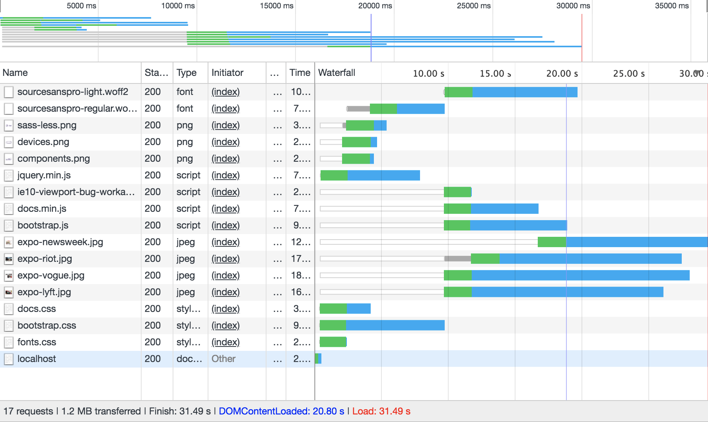
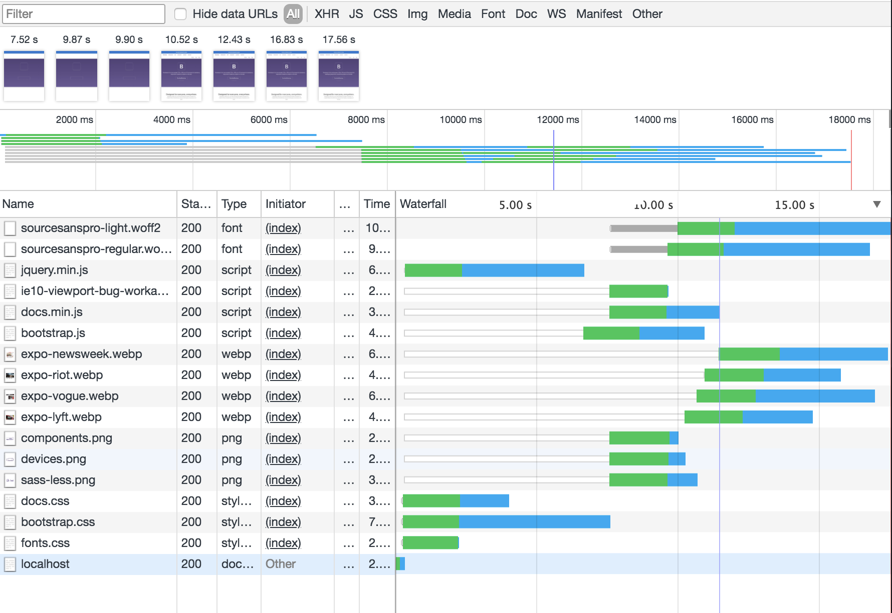
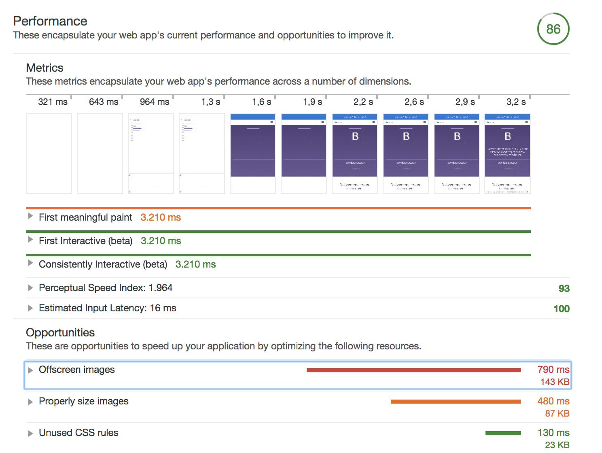
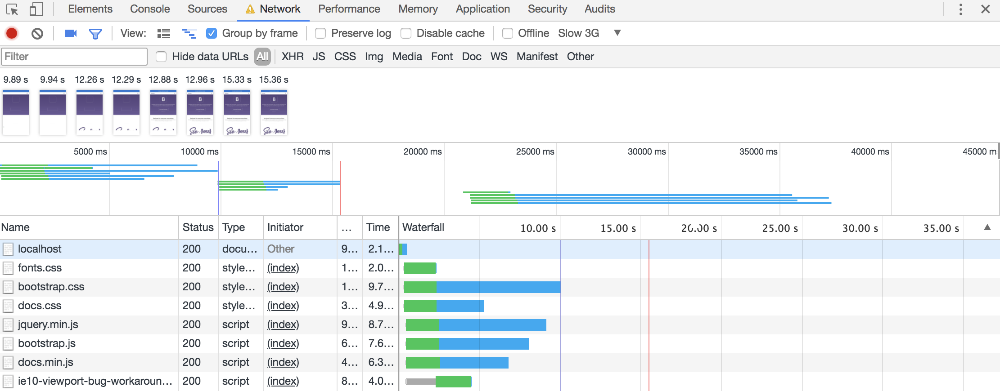
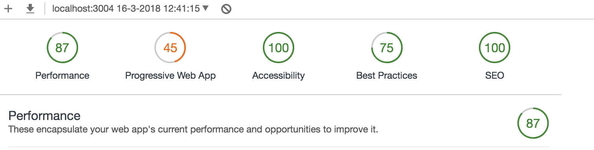
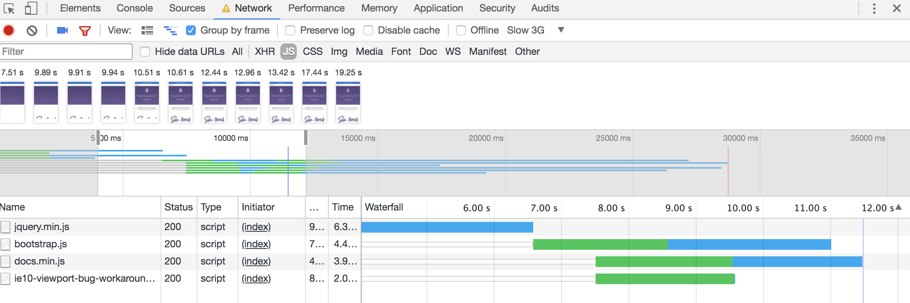
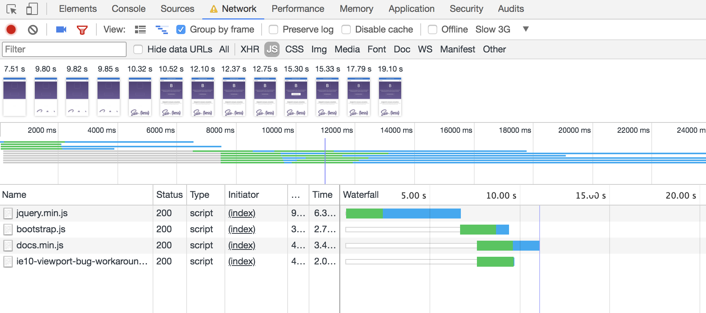

# Fonts


Font loaded


Font loaded

Used FontFaceObserver.js (which you can find in the vendor directory). To make the font-face work i used the code. Source : [presentation of Declan of Voorhoede](https://www.voorhoede.nl/en/blog/why-our-website-is-faster-than-yours/)

```JS
// (include FontFaceObserver here)
  var font = new FontFaceObserver('source_sans_pro');
  var html = document.documentElement;
// load font async, then enhance HTML:
font.load().then(function () {
  html.className += ' fonts-loaded';});
```

# minfied CSS


Unminified CSS files!


Minified CSS files!

The CSS that is minified changed a lot on slow 3G setting. Especially the bootstrap file. a Whole second! WOAH!.

I used [css minifier](https://cssminifier.com/) to minify it for the assignment. You could use packages for this a big one is [css-minifiers](https://www.npmjs.com/package/css-minifiers).

# webp


it takes 30 seconds to load the page without webp


it takes 18 seconds to load the page with webp

To convert the images in `.webp` i used the website [Convertio](https://convertio.co/nl/webp-converter/). It works fine and it cuts a lot of load time.

# Lazyloading


Without the lazyloading.


The website loading with lazyloading. The red line is the indicator that the loading is done but there are things to be loaded in.
After the red line the images load in because you scrolled there.


Without the lazyloading.


```JS

const images = document.querySelectorAll('[data-src]');
const config = {
  rootMargin: '0px 0px 50px 0px',
  threshold: 0
};
let loaded = 0;

const observer = new IntersectionObserver(function (entries, self) {
  entries.forEach(entry => {
    if (entry.isIntersecting) {
      preloadImage(entry.target);
      self.unobserve(entry.target);
    }
  });
}, config);

images.forEach(image => {
  observer.observe(image);
});

function preloadImage(img) {
  const src = img.getAttribute('data-src');
  if (!src) { return; }
  img.src = src;
}

```

# Minified JavaScript


The bootstrap.js file not minified


The bootstrap.js file minified


All unminified files


All minified files

You could use a package to minify your javascript but in the case of seeing a difference. I used the https://jscompress.com/ <- compress the JS/Minify.  

# Text Compression


without text compression.


Used compression npm package.

## how

Used npm package compression.
[Compression on NPM](https://www.npmjs.com/package/compression)

In the server.js file i required the compression and had to call it with.
```JS
app.use(compression());
```


## After Feedback

Well i did my tests with "disable cache on" BUT i have this awful bug now that won't show the files in my chrome.
Restarted my chrome, my laptop, it just wouldn't fix?


But on Chrome Canary it works just fine ?!


## Without critical css

So i ran the test again without critical CSS and Well....

- [x] critical css wasn't needed.

It actually slowed a lot down! As for performance.

